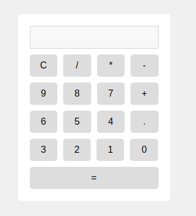

# Overview
Jcube is frustrated of no calculator in his iPad. He decided to make one himself. He is not good at programming, so he asked you to help him. He wants a simple calculator that can do addition, subtraction, multiplication and division. The code is his attempt to make a calculator. He has written the code, but it is not working. Can you help him fix the code?

# Bug List

## Bug 1:
He is not able to see the calculattor as he wants it to be. The expected result is shown below. Make it look like the expected result.

## Bug 2:
He is not able to see the mathematical result of his calculations. Make the calculator show the result of the calculations.

<b>All The Best...👍🏻</b>